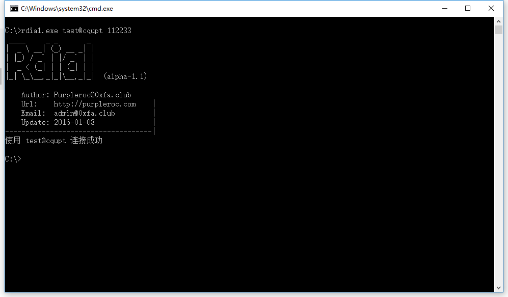

# Rdial
Rdial is a Windows program for the user who want to replace Netkeeper.  
You can easily connect to the Internet without install Netkeeper. And also can share your net without the limit of Netkeeper.  
You can compile youself or can also download the binary in Release directory.  

## Usage:
Just put `rdial.exe` in **C:\Windows\** and type the follow command:  
`rdial.exe username password`  
eg:  
`rdial.exe test@cqupt 112233`  

## Show:
  

## Enjoy it!
